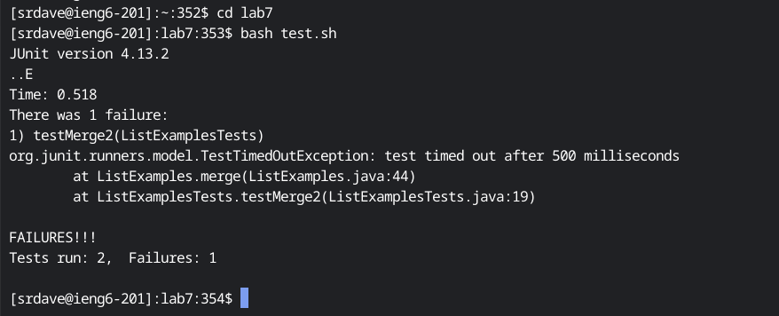

# Lab Report 4

## Step 4: Log into ieng6

Keys Pressed: `<up> <enter>` 

The `ssh srdave@ieng6.ucsd.edu` command was one step up in history, so I pressed the `up` key once and pressed enter. This command logs me into the ieng6 
server so I can do the rest of the assignment on that server. 

## Step 5: Clone Fork of Repository

Keys Pressed: `git clone <right click>`

The `git clone git@github.com:Srujam-Dave/lab7.git` command clones the git repo with all the necessary files to the ssh server. I typed in `git clone` 
manually and pasted the SSH URL using a right click. Finally, I pressed `<enter>` to make the command run, thus cloning the repository at the URL to the
ieng6 server.

## Step 6: Run Tests

Keys Pressed: `cd lab7 <enter> <up> <up> <up> <up> <up> <up> <up> <enter>` 

First, I typed in the keys `cd lab7` and pressed `<enter>`, which moves me into `./lab7`,the directory created when I cloned the git repository. The 
`bash test.sh` command was seven slots in history upwards, so I pressed the up key seven times and pressed enter. This command runs a bash script that runs
the JUnit test cases for the ListExamples.java file. The second test did not pass. 

## Step 7: Edit Code

Keys Pressed: `vim ListExamples.java <enter> :44 <enter> e r2 :wq <enter>`

First, I manually typed in the command `vim ListExamples.java` and pressed enter. This command opens up the ListExamples.java file in vim. The 
`:44` command, which I also ran by manually typing it in and pressing enter, takes the cursor to the 44th line, where the error is. The `e` takes the 
cursor to the end of the first word in the line, which is what needs to be replaced.`r2` replaces the last character in that word with a 2, making the 
contents of the line `index2 += 1', which should fix the infinite loop found in the test. Finally, `:wq <enter>` saves the file and exits vim.

## Step 8: Run Tests

Keys Pressed: `<up> <up> <up> <up> <up> <up> <up> <enter>` 

The `bash test.sh` command was seven slots in history upwards, so I pressed the up key seven times and pressed enter. This command is the `bash test.sh` 
command, which runs a bash script that runs the JUnit test cases for the ListExamples.java file. This time, every test passed.

## Step 9: Commit and Push Change

Keys Pressed: `<up> <up> <up> <up> <up> <up> <up> <enter> <up> <up> <up> <up> <up> <up> <up> <enter> git push <enter>`
The `git add ListExamples.java` and `git commit` commands both were seven commands up in the history, so to pull up and run each command, I pressed `<up>`
seven times and pressed `<enter>`. The `git add` and `git commit` commands together tell git that ListExamples.java needs to be added to the git 
repository, then commit the changes made to the file to the git repository. Finally, I typed in `git push` to actually push the changes to the github
repository that the files were originally uploaded from.
