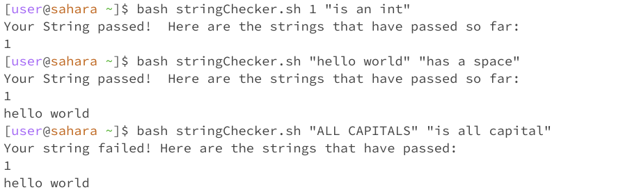
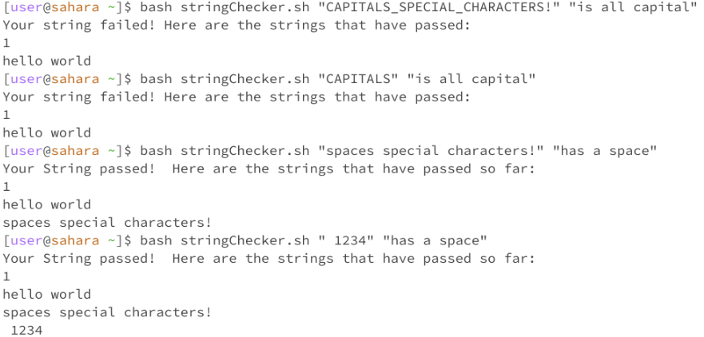

# Lab Report 5

## Part 1: Debugging Scenario

### 1: Original Student Post

Hi! I'm trying to use bash and java to create a program that takes in a string and a certain condition, checks if the string meets the given condition, and saves the string if it does. More 
specifically, I used a bash script to print ouptut for the user to the terminal, as well as to save the string to a file, while I used java to write the functions that actually check if the string
meets certain conditions. While my program works fine for some inputs, it fails for others:



The symptom seen here is that for the string "ALL CAPITALS", the program prints that the string does not meet the condition of being in all capitals and does not save the string, since the string
meets this condition and should be saved. My guess is that, since it seems like there isn't any problem with how the strings are being saved, there must be some kind of issue with my
java program that checks if a string is in all capitals. However, while looking at the java file, I'm having trouble seeing the problem. 

### 2: TA Response

Hello student. Have you tried testing if your program passes and fails for a more diverse array of input strings? For example, you should try seeing if your program recognizes if strings without any
spaces, or strings that have special characters, are capitalized. You should also check if similar problems exist with the other conditions you're trying to check, such as checking for integers or
spaces.

### 3: Terminal Output and Bug Description



The output shows that symptoms only occur when the second argument to the bash script is "is all capitals". Because the bash script only prints out the output for the user and saves the string, and
both of these parts of the program function as they should, this implies that the bug is in the java program that checks if the string matches a given condition. Furthermore, since the program 
functions fine when checking if a string has spaces or if it represents an integer, this implies that the error is in the method that checks if the string is all capital. Finally, since this method
fails with all strings in a wide array of circumstances, this shows that this method has an error that causes it to always evaluate that the string isn't in all caps, regardless of the contents of
the string itself.

### 4: Information

- **File and Directory Structure:** The program must have the `StringChecker.java` and `stringChecker.sh` files in the same directory for `stringChecker.sh` to function correctly. `stringChecker.sh`
creates another file where it saves the strings that passed its tests, but the script checks if the file exists already, so there's no reason to check if it's already in the directory.

- **Contents of Files Before Bug Fix**:

`StringChecker.java`:
```
// Contains methods that return true/false if a string 
// passes/fails a certain condition
public class StringChecker {

    // String passes if every letter in the string is capitalized
    static String isCapital(String str) {

        //loops through every character to determine if it's capital
        char[] chars = str.toCharArray();
        for (char character : chars) {
            if (Character.isLetter(character) 
                || Character.isLowerCase(character)) {
                return "Failed";
            }
        }

        return "Passed";
    }

    // String passes if the string holds the value of an integer
    static String isNum(String str) {
        try {
            int strToInt = Integer.valueOf(str);
        } catch( NumberFormatException e) {
            return "Failed";
        }
        return "Passed";
    }

    //String passes if the string has any spaces in it
    static String hasSpaces(String str) {

        //loops through every character to determine if it's a space
        char[] chars = str.toCharArray();
        for (char character : chars) {
            if (character == ' ') {
                return "Passed";
            }
        }
        return "Failed";
    }

    // Checks if the string in the first command line argument passes the 
    // condition specified in the second command line argument
    public static void main(String[] args) {
        if (args.length != 2) {
            System.out.println("Invalid inp");
            System.exit(0);
        }

        if (args[1].equals("is all capital")) {
            System.out.println(StringChecker.isCapital(args[0]));
        } else if (args[1].equals("is an int")) {
            System.out.println(StringChecker.isNum(args[0]));
        } else if (args[1].equals("has a space")) {
            System.out.println(StringChecker.hasSpaces(args[0]));
        } else {
            System.out.println("Invalid input");
        }
    }
}
```

`stringChecker.sh`:
```
if [ -f "passed.txt" ]
then
    javac StringChecker.java
else
    touch passed.txt
    javac StringChecker.java
fi

error="Invalid input"
passed="Passed"
failed="Failed"

javaOutput=$(java StringChecker "$@")

if test "$javaOutput" = "$error"
then 
    echo $javaOutput
    exit
fi

if test "$javaOutput" = "$passed"
then
    echo "$1" >> passed.txt
    echo "Your String passed!  Here are the strings that have passed so far:"
    cat passed.txt
fi

if test "$javaOutput" = "$failed"
then
    echo "Your string failed! Here are the strings that have passed:"
    cat passed.txt
fi
```


- **Command Line Output Showing Bug**

The symptom is that for the string "ALL CAPITALS", the program prints that the string does not meet the condition of being in all capitals and does not save the string, since the string
meets this condition and should be saved. 

- **Bug Fix**: In the `isCapital` method in the `StringChecker` class in `StringChecker.java`, the condition that checks if a character in the string is lowercase (and returns that the string
  failed as a result) is `Character.isLetter(character) || Character.isLowerCase(character)`, which checks that the string is a letter, and if so, if it's lowercase. However, becasue the `||`
  operator is used, the entire condition will return true as soon as a letter appears in the string, which causes most input strings to fail. The solution is to change the `||` operator to an
  `&&` operator, which means that the condition will only evaluate to true if the character in question is a lowercase letter, which is the desired behavior. This means that the method only returns
  that the string failed if there's a lowercase letter in the string, which fixes the bug.

## Part 2: Reflection
One cool thing that I learned in the second half of this quarter was the difference between the input stream, standard output stream, and the standard error stream. I thought it was useful and
interesting how bash separates standard outputs from error messages, which gives programmers more information about what their programs are outputting (for example, even if standard output is 
redirected to a different file, the programmer will still see the output stream). I also thought it was cool how java and bash can both write to/read from both output streams, which is useful if
you're making software that's being used by a third party. Finally, I thought it was interesting how the input and output streams had different properties, which affects the different contexts 
they're used in (such as how Prof. Politz used an input stream when configuring a Process object so he could more easily write to the stream). 
